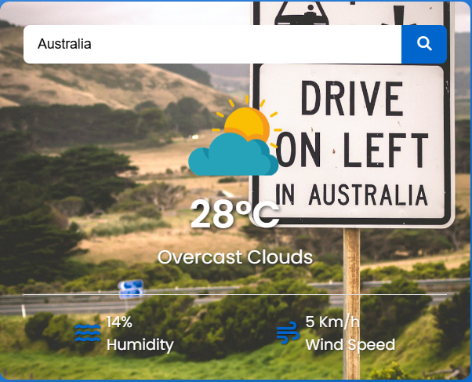

# Dynamic Weather App

## Description

The Dynamic Weather App provides real-time weather information for any city around the world. It features a user-friendly interface where users can input a city name to retrieve the current weather conditions, including temperature, humidity, wind speed, and more. The app dynamically updates the background image based on the selected city, giving users a visually appealing experience.

## Features

- Search for current weather by city name.
- Display of temperature, humidity, and wind speed.
- Dynamic background images sourced from Unsplash based on the city's weather.
- Responsive design for mobile and desktop views.
- User-friendly interface with clear, easy-to-read information.
